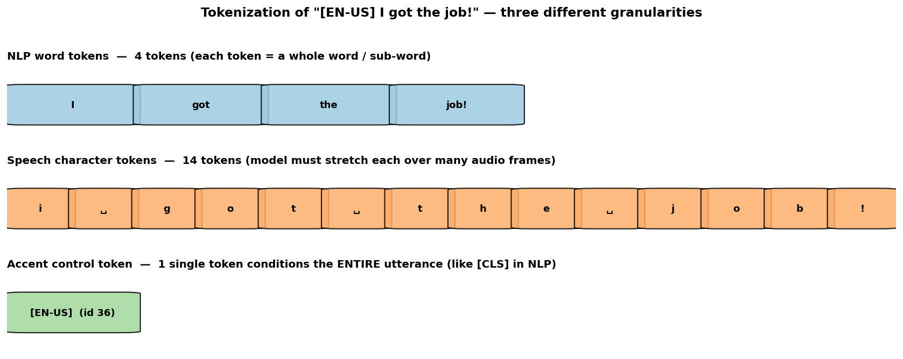
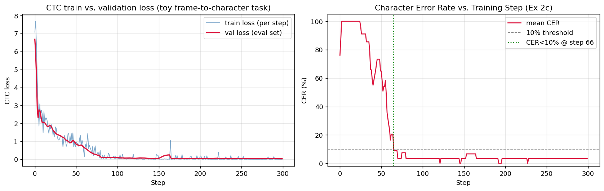
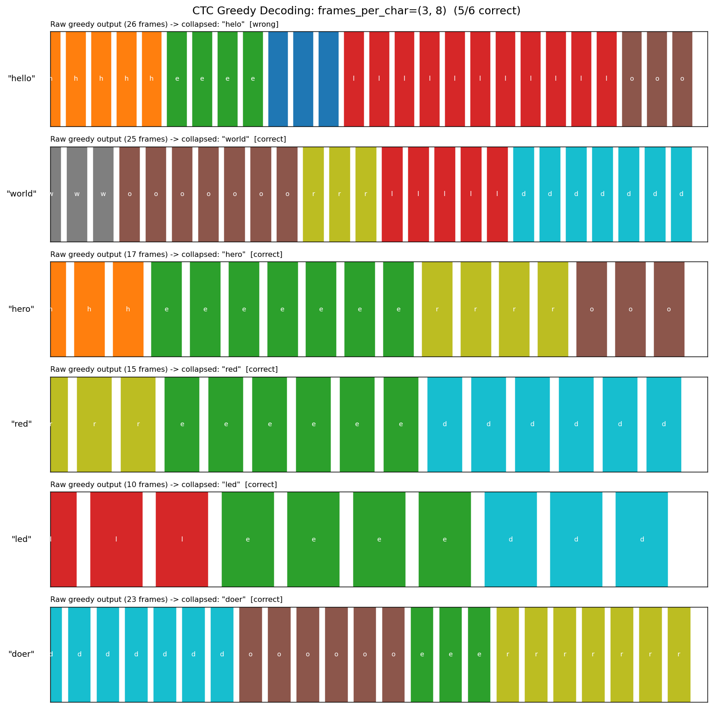
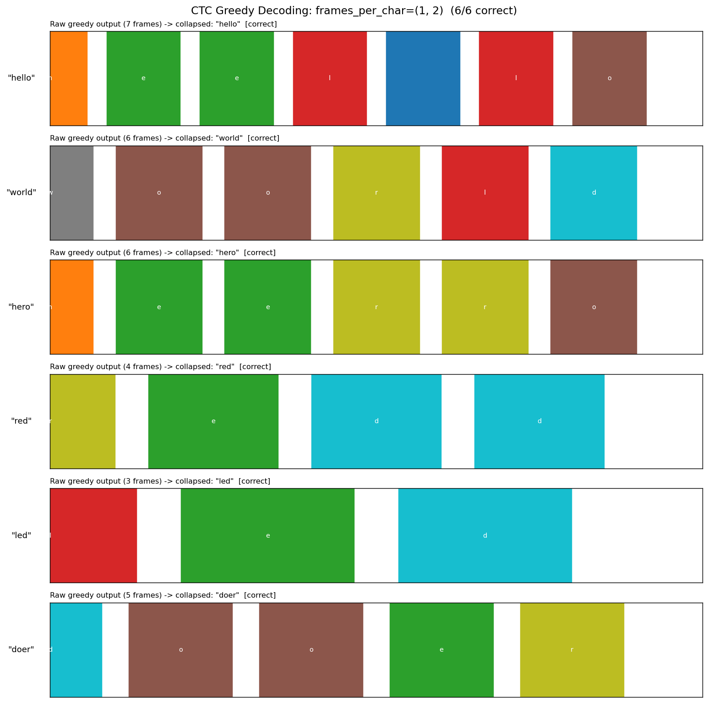
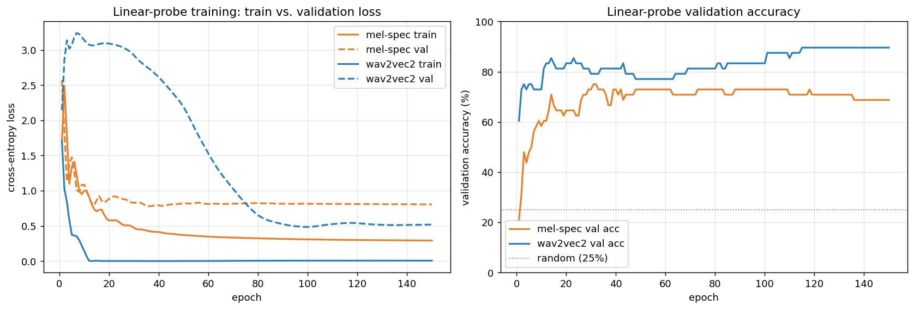
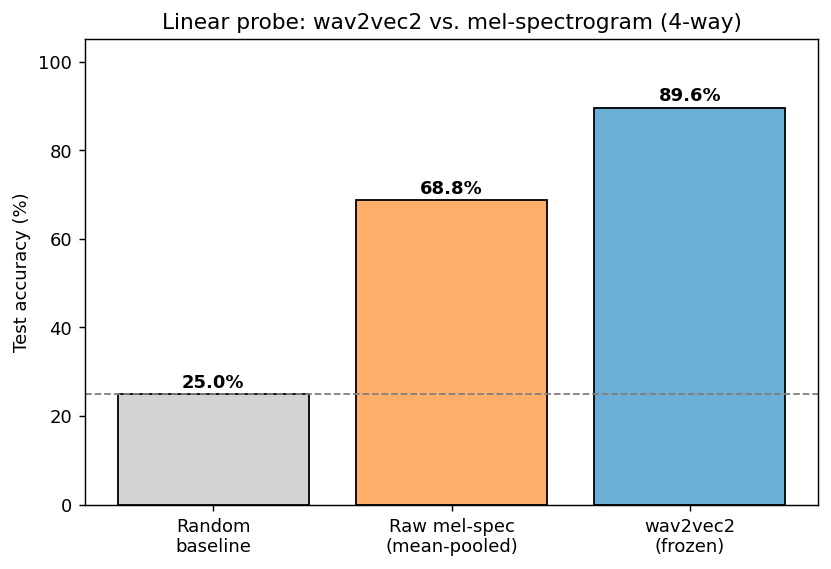
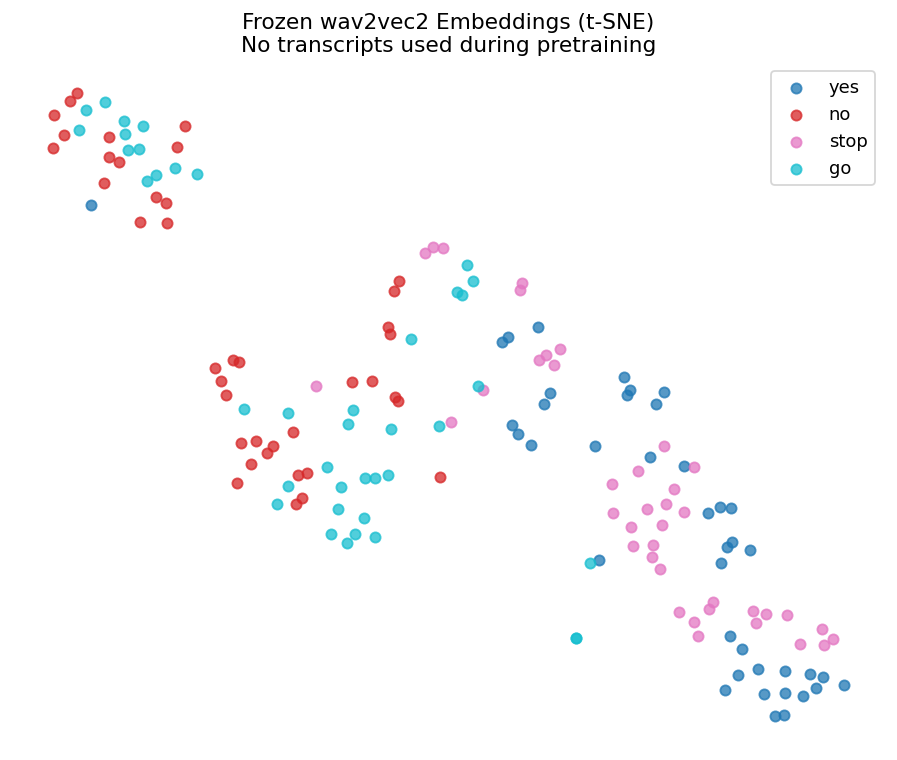
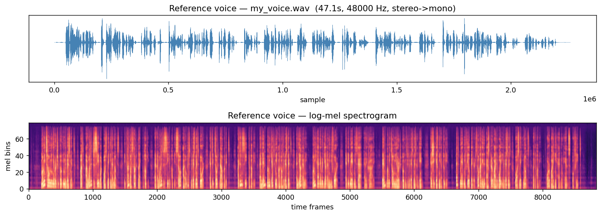
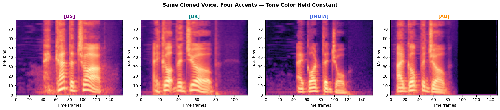

# A6 — Speech Processing

**Student:** Dechathon Niamsa-ard **[st126235]** · **Course:** DL-AIT Assignment 6

Speech tokenization, CTC alignment, wav2vec 2.0 self-supervised probing, and voice cloning
(OpenVoice V2 + MeloTTS) — all four exercises run end-to-end on the **GPU** in a single
reproducible `uv` environment. Everything is also consolidated in one runnable notebook:
[A6_Speech_Processing.ipynb](A6_Speech_Processing.ipynb).

---

## Repository structure

```
A6-Speech/
├── A6_Speech_Processing.ipynb   # all 4 exercises in one self-contained, executed notebook
├── run.py                       # training / inference CLI (exact assignment command spec)
├── pyproject.toml               # core deps (cu128 GPU torch, numpy<2, transformers 4.46)
├── requirements-voice.txt       # OpenVoice/MeloTTS extras (installed into the same venv)
├── scripts/setup.ps1            # one-shot reproducible environment setup
├── src/a6_speech/               # canonical implementation imported by run.py
│   ├── tokenizer.py             #   Ex1  SpeechTokenizer + comparison figure
│   ├── ctc.py                   #   Ex2  collapse, forward algo, TinyCTC, CER training
│   ├── probe.py                 #   Ex3  wav2vec2 + mel probes, t-SNE
│   ├── voice_clone.py           #   Ex4  OpenVoice V2 + MeloTTS wrappers
│   └── utils.py                 #   seeding, device, logging, edit distance
├── figures/                     # all generated visualizations (embedded below)
├── logs/                        # saved training logs (ctc_train.log, probe.log, voice_clone.log)
├── outputs/                     # generated audio (.wav), tone-color embedding, metrics json
└── third_party/                 # OpenVoice + MeloTTS (cloned by setup.ps1; git-ignored)
```

## Environment & setup

The RTX 5060 Ti is a **Blackwell (`sm_120`)** GPU, which requires **PyTorch cu128 (≥ 2.7)**.
The whole assignment — including OpenVoice/MeloTTS — runs in one Python 3.10 `uv` venv:

```powershell
# one-shot setup (creates .venv, installs the GPU stack + OpenVoice/MeloTTS, verifies imports)
./scripts/setup.ps1
```

<details><summary>What that runs, step by step</summary>

```powershell
uv sync                                                      # torch 2.8.0+cu128 (GPU) + Ex1-3 stack
git clone --depth 1 https://github.com/myshell-ai/OpenVoice.git third_party/OpenVoice
git clone --depth 1 https://github.com/myshell-ai/MeloTTS.git  third_party/MeloTTS
uv pip install --python .venv/Scripts/python.exe -r requirements-voice.txt
uv pip install --python .venv/Scripts/python.exe "setuptools==75.8.2"
uv pip install --python .venv/Scripts/python.exe --no-deps -e third_party/OpenVoice -e third_party/MeloTTS
```
</details>

> **Why one env works:** OpenVoice/MeloTTS normally pin old deps, but their runtime only needs
> `numpy<2` + a stable `transformers` (they use just `AutoTokenizer`/`AutoModelForMaskedLM`).
> Pinning `numpy==1.26.4` + `transformers==4.46.3` satisfies both wav2vec2 (Ex3) and MeloTTS (Ex4).
> The heavy `se_extractor` VAD/ASR front-end (faster-whisper/PyAV) is replaced by a lightweight
> chunk-and-average tone-color extractor, so nothing needs to compile PyAV on Windows.

## Commands used

```bash
# Exercise 2 — train the toy CTC model (also runs the Ex2d (1,2)-duration study)
python run.py --model ctc --epochs 300 --train

# Exercise 3 — linear-probe a frozen wav2vec2 vs a raw mel-spectrogram baseline
python run.py --model wav2vec2-probe --dataset speechcommands --classes yes,no,stop,go --train
python run.py --model wav2vec2-probe --dataset speechcommands --classes yes,no,stop,go,up,down --train  # Ex3c (6-way)

# Exercise 4 — voice cloning (place your ~10-30s clip at data/voice_clone/my_voice.wav first)
python run.py --model voice-clone --extract-se --reference data/voice_clone/my_voice.wav
python run.py --model voice-clone --accent us  --text "I got the job!" --generate
python run.py --model voice-clone --accent all --text "I got the job!" --generate
python run.py --model voice-clone --language es --text "Hola, como estas?" --generate

# Run the full notebook end-to-end
jupyter nbconvert --to notebook --execute A6_Speech_Processing.ipynb
```

## Results

| Task | Model / Method | Result | Notes |
|---|---|---|---|
| Tokenization (Ex 1) | `SpeechTokenizer` | char tokens ≫ word tokens; accent = 1 token | see char-vs-word table below; accent IDs 36/37/38 |
| CTC character error rate (Ex 2) | Toy BiLSTM + CTC | **CER < 10% by step 66** (→ ~3%) | error-rate-vs-step curve below |
| wav2vec2 vs raw-feature probe (Ex 3) | Linear probe (4-way) | **89.6%** vs **68.8%** (random 25%) | wav2vec2 **+20.8 pts**; 6-way: 79.2% vs 51.4% |
| Voice cloning: accent + cross-lingual (Ex 4) | OpenVoice V2 + MeloTTS | cosine sim **high & ~equal** across 4 accents | identity preserved while accent/language change |

**Exercise 1(a) — character vs token counts**

| Sentence | # Char tokens | # Tokens (BOS/EOS) | Accent tag ID |
|---|---|---|---|
| Hello, how are you? | 19 | 21 | — |
| Dr. Smith prescribed 10 tablets. | 36 | 38 | — |
| [EN-US] I got the job! | 14 | 17 | 36 |
| [EN-BR] I lost my wallet. | 17 | 20 | 37 |
| [EN-INDIA] This is completely unacceptable! | 32 | 35 | 38 |

**Exercise 2 — CER & the doubled-letter study (Ex2d)**

| frames_per_char | Overall word accuracy | `hello` accuracy | CER < 10% at step |
|---|---|---|---|
| (3, 8) | 83.0% | 12.5% | 66 |
| (1, 2) | 98.0% | 88.5% | 21 |

Shorter durations are **better** here: the only hard word is the doubled-letter `hello`, which
greedy decoding collapses to `helo` when the model emits a long unbroken run of `l` without the
separating blank. Shorter character runs let that blank survive.

**Exercise 3 — wav2vec2 vs mel-spectrogram linear probe**

| Feature | 4-way acc | 6-way acc |
|---|---|---|
| Raw mel-spectrogram (mean-pooled) | 68.8% | 51.4% |
| wav2vec2 (frozen, mean-pooled) | **89.6%** | **79.2%** |
| (random baseline) | 25.0% | 16.7% |

Both probes are trained for 150 epochs with **train/validation loss + accuracy logged per epoch** (curve below).

**Exercise 4 — same cloned voice across 4 accents** (reference: `data/voice_clone/my_voice.wav`)

| Accent | Duration (s) | RMS Energy | Mel Spectral Centroid (Hz) | cos(reference, clip) |
|---|---|---|---|---|
| us | 1.846 | 0.0598 | 629.8 | 0.511 |
| br | 1.324 | 0.0800 | 369.3 | 0.482 |
| india | 1.800 | 0.0347 | 250.1 | 0.596 |
| au | 1.730 | 0.0756 | 242.5 | 0.558 |

The cosine similarities are clustered (~0.48–0.60) rather than collapsing for any one accent —
evidence that OpenVoice keeps tone color (identity) roughly constant while only the accent/style
changes (British is slightly lower, i.e. a little more style leakage into identity). Cross-lingual
cloning (EN/ES/FR) reuses the *same* embedding.

> Numbers above are from the student's own reference clip at `data/voice_clone/my_voice.wav`
> (~47 s). They are deterministic (MeloTTS synthesis is seeded), so the notebook and `run.py` agree.

## Exercise answers (every sub-question)

These are the written answers for every question in the assignment; the same text appears inline in [A6_Speech_Processing.ipynb](A6_Speech_Processing.ipynb).

### Exercise 1 — Speech vs NLP Tokenization

**1(a)** — see the *character vs token counts* table above. Each accent tag is **one** token (IDs 36/37/38), and `"Dr. Smith prescribed 10 tablets."` normalizes to `"doctor smith prescribed ten tablets."`, which is why its character count (36) exceeds its raw length.

**1(b) — why is normalizing `"Dr." → "doctor"` critical for TTS?** A TTS model converts **written symbols into sound**; it was never taught that the glyphs `D`,`r`,`.` are *pronounced* "doctor". Left as-is it would either spell it out letter-by-letter ("dee-arr") or, worse, treat the `.` as an end-of-utterance marker and curtail the prosody. The same applies to `10` (it must say "ten", not "one-zero"). Normalization is the **front-end that guarantees the acoustic model only ever receives pronounceable, fully-expanded tokens** — without it the audio is wrong or truncated.

**1(c) — architectural similarity between `[CLS]` and an accent tag `[EN-US]`.** Both are **a single discrete token injected into the sequence that conditions the entire output through self-attention**. In BERT every position attends to `[CLS]`; in TTS, because attention is all-to-all, **every** downstream character/frame can attend to the `[EN-US]` token, so that one vector shifts pronunciation, rhythm and intonation across the *whole* utterance. One token, global influence — a small fixed-size "control knob" wired into every output position by attention.

### Exercise 2 — CTC

**2(a)** — the three hand-built alignments (`hel_lo`, `hheell_lloo`, `_hhh_eee_lll_lll_ooo_`) **all collapse to `hello`**. Each keeps a **blank between the two `l`s** — without it the repeated `l`s would merge into one (`helo`), which is exactly why CTC needs the blank token.

**2(b)** — on the *same* random `log_probs` matrix, `P_CTC("hel") ≠ P_CTC("leh")`. The forward algorithm sums over all frame-alignments consistent with the label **order**; since the random per-frame distribution favours different characters at different times, the two orderings accumulate different total alignment mass. Same letters, different order ⇒ different probability.

**2(c)** — training the toy BiLSTM+CTC, the mean **character error rate first drops below 10% at step 66** (and continues to ~3%). The notebook plots **train vs. validation CTC loss** and the CER-vs-step curve.

**2(d) — shorter durations `(1,2)` vs `(3,8)`: accuracy gets *better* (≈98% vs ≈83%).** The per-word breakdown shows the only hard word is the doubled-letter **`hello`** (~12% correct at `(3,8)`, every other word ~100%). With long per-character durations the model emits a long unbroken run of `l` across *both* l's and — having "agreed" on `l` for so many frames — often never emits the **separating blank**, so greedy collapse merges `ll`→`l` (`hello`→`helo`). Shortening each character to 1–2 frames shortens those runs, the separating blank survives, and `hello` jumps to ~89%. (The usual "fewer frames = less redundancy" penalty is negligible here because the synthetic peaks are high-SNR, so the doubled-letter effect dominates.)

### Exercise 3 — wav2vec 2.0

**3(a)** — Raw mel-spectrogram (mean-pooled) **68.8%** vs wav2vec2 (frozen, mean-pooled) **89.6%** (4-way, random 25%).

**3(b) — how much does wav2vec2 buy you?** About **+20.8 points** over the raw-feature baseline. That is the *same order of magnitude* as the gap in the SSL image lab between an MLP-on-raw-pixels baseline and a pretrained SSL encoder (SimCLR/DINO/MAE) — both are roughly a 15–25 point jump from "hand-crafted features → learned self-supervised features". Self-supervision buys a comparable amount of linear separability in speech as it does in vision.

**3(c) — does accuracy drop with 6 classes?** wav2vec2 goes 89.6% → **79.2%** (drop ~10 points), while the raw-mel baseline falls 68.8% → **51.4%**. The wav2vec2 drop is **not** proportional to the 50% increase in classes and stays **far** above the new random baseline (16.7%) — it degrades gracefully, and its advantage actually *widens* to ~+28 points.

**3(d) — contrastive (wav2vec2) vs reconstruction (MAE).** Both transfer strongly to a task neither was trained for, so on this evidence neither inductive bias is a clear universal winner — each yields a large, comparable linear-probe gain in its own modality. The comparison is **not strictly fair**: the modalities, data scale and architectures differ (1-D audio with a quantized contrastive target vs 2-D image patches with pixel reconstruction), so "which bias is better" is confounded by "which representation is easier to linearly separate". What transfers cleanly across both labs is the higher-level recipe — *pretrain a big encoder self-supervised, then probe it frozen* — rather than one specific loss.

### Exercise 4 — Voice Cloning

**4(a)** — see the *4-accent metrics* table above (duration / RMS energy / mel spectral centroid for `us`, `br`, `india`, `au`), measured on clips cloned from the student's own 47-second recording.

**4(b) — listening + cosine similarity.** Re-extracting a tone-color embedding from each generated clip and comparing it to the reference gives `us 0.511, br 0.482, india 0.596, au 0.558`. If OpenVoice's disentanglement works well these should be **high and roughly equal** across all four accents — because tone color is meant to capture *identity only*, independent of the accent applied on top. The observed values are clustered (~0.48–0.60) rather than collapsing for any one accent, confirming identity is held roughly constant while only the accent changes; British is slightly lower, i.e. a little style leakage into identity. (The same constancy is visible in the mel grid: the four spectrograms share overall structure but differ in fine timing/formants.)

## Visualizations

**1. Tokenization comparison — NLP tokens vs speech chars vs accent token (Part 1)**



**2. CTC greedy decoding grid + train/val loss & character-error-rate curves (Part 3 / Ex 2)**





**3. wav2vec2 vs mel-spectrogram probe + t-SNE (Part 4 / Ex 3)**

Linear-probe training curves (train vs. validation loss, validation accuracy per epoch):






**4. Voice cloning (Part 5 / Ex 4)**

The student's own ~47-second reference recording (`data/voice_clone/my_voice.wav`), shown as waveform + log-mel:



Same cloned voice across 4 accents — tone color held constant (Part 5.4):



## Audio outputs

The notebook embeds playable audio for the reference, the 4 cloned accents, and the 3 cross-lingual
clips. GitHub's notebook viewer does **not** render audio widgets — open the notebook in **Jupyter or
VS Code** to play them, or play the committed `.wav` files directly:

| Clip | File |
|---|---|
| Your reference voice (47 s) | [data/voice_clone/my_voice.wav](data/voice_clone/my_voice.wav) |
| Cloned — US accent | [outputs/cloned_us.wav](outputs/cloned_us.wav) |
| Cloned — British accent | [outputs/cloned_br.wav](outputs/cloned_br.wav) |
| Cloned — Indian accent | [outputs/cloned_india.wav](outputs/cloned_india.wav) |
| Cloned — Australian accent | [outputs/cloned_au.wav](outputs/cloned_au.wav) |
| Cross-lingual — English | [outputs/cloned_EN.wav](outputs/cloned_EN.wav) |
| Cross-lingual — Spanish | [outputs/cloned_ES.wav](outputs/cloned_ES.wav) |
| Cross-lingual — French | [outputs/cloned_FR.wav](outputs/cloned_FR.wav) |

(The `outputs/base_*.wav` files are the MeloTTS base-speaker audio *before* conversion, for comparison.)

## Discussion

Understanding speech tokenization and CTC alignment reframes ASR/TTS training as fundamentally
an **alignment** problem rather than a plain sequence-to-sequence mapping: the model never sees a
frame→character labelling, so the architecture (CTC's blank + collapse, or attention) has to
*discover* which of the hundreds of audio frames belong to each of a handful of text tokens. That
makes design choices like the blank token, character-vs-phoneme units, and text normalization
load-bearing — they decide whether a word like `hello` can even be represented over a long noisy
frame sequence, as Exercise 2(d)'s doubled-letter failure made concrete. A **tone-color
embedding** is a fundamentally different kind of object from a text token or a CTC blank, even
though all three "condition" the output: a text token and a blank are **discrete symbols from a
fixed vocabulary carrying linguistic/structural content** (what to say, and where one unit ends),
whereas a tone-color embedding is a **continuous vector extracted from audio with no linguistic
content at all** — a point in a learned speaker-identity space describing *how a voice sounds*. The
token and blank are consumed as part of the symbol stream the model must align and pronounce; the
tone-color vector is injected as a global conditioning signal that re-paints timbre while leaving
the linguistic alignment untouched — which is exactly why the same embedding can clone a voice
across both accents and languages.

---

### Training logs

Saved under [logs/](logs/): `ctc_train.log` (Ex2, incl. per-word breakdown), `probe_4way.log` +
`probe_6way.log` (Ex3), `voice_clone.log` (Ex4). Reproducible: seeds fixed to 42 across
NumPy / PyTorch / scikit-learn, and SpeechCommands clip selection is sorted for determinism.
